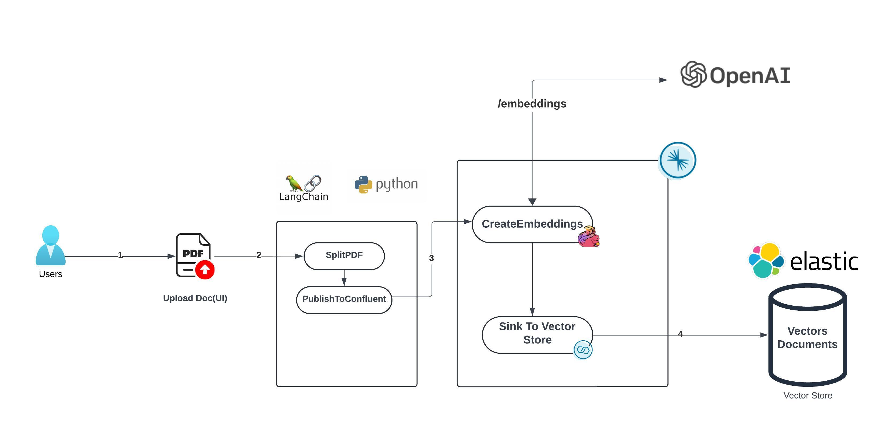
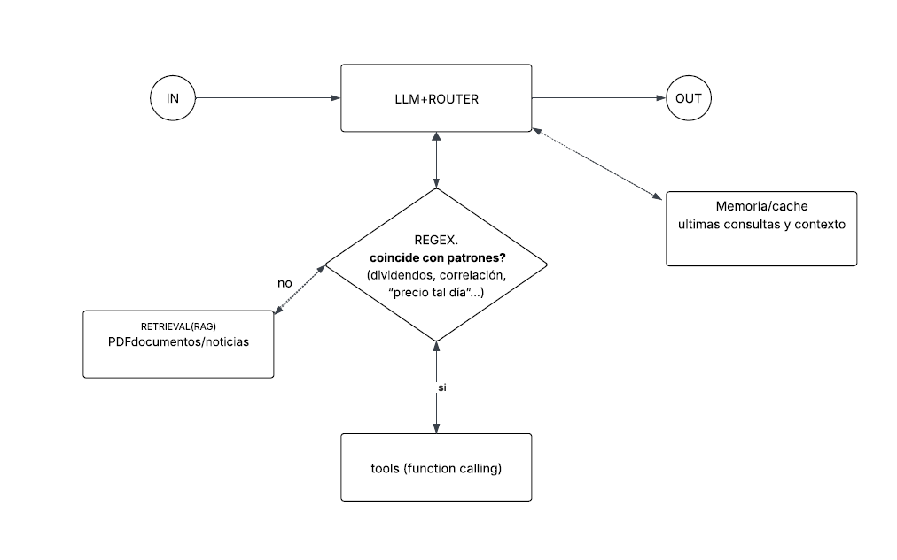

# Roboadvisor

A chatbot that will use PDF documents to simulate the extraction of information from an enterprise API that stores all investor portfolios. This increases the bot’s knowledge so that, together with real-time international market data obtained from APIs such as Polygon.io, it can combine these datasets and provide the user with a real-time financial advisor that not only knows their personal portfolio but also the current state of the global market.

This experience typically includes the following features:

1. **Data augmentation**:
   

   
   * Users upload financial documents or account summaries in PDF format, which can later be scaled to direct connections with the APIs of companies that store each client’s information..
   * The platform processes these documents by splitting them into individual pages and publishing the content of each page, along with the relevant metadata, to a Kafka topic..
   * A fully managed Elastic sink connector reads the vector data from the topic and stores the vector embeddings. The documents are now prepared for chatbot queries.
   * Create search index on vector embeddings field in Elastic


2. **AI-Powered Interaction**: This architecture integrates a generative AI model (such as GPT) capable of reading, understanding, and interacting with the content of the documents, as well as with real-time stock market information. Users can ask the robo-advisor questions about the document, request summaries, ask for clarifications, and obtain combined insights with stock market values.
   
   Data Inference flow:


   * Users submits query through chatbot prompt, python microservice receives request on HTTP and generate an event to Kafka topic.
   * Python-Kafka consumer receives chatbot request, query vector store (Elastic) using vector search and pass the information to OpenAI to get an answer.
   * In the response provided, if tickers or benchmark indices are mentioned, the answer is enriched using real-time data from other private data sources..
   * Once the answer is fully enriched, A Python-Kafka consumer receives the final response from topic and sends to roboadvisor using websocket.
     

3. **Contextual Understanding**: The robo-advisor understands the context of the questions in relation to the content of the document and, in turn, combines it with market information if the prompt contains any reference to a stock ticker or market index. This makes the interaction more meaningful and accurate.


## Demo Setup:

### Prerequisites
It is important to mention that WebStorm was used as the IDE for development, due to personal preference, but the project can be run in any IDE of your choice.
#### Tools
* install git to clone the source
  
  ```
  yum install git
  ```
* install npm to install UI dependency packages (below example to install npm from yum package)
  ```
  yum install npm
  ```
* install python3
  ```
  yum install python3
  yum install --assumeyes python3-pip
  ```
#### Docker
* docker-compose.yml espera que existan dos claves de API en variables de entorno:
  ```
  FINNHUB_KEY=TU_FINNHUB_API_KEY_AQUI
  POLYGON_KEY=TU_POLYGON_API_KEY_AQUI
  ```
* Ir a la carpeta donde está el docker-compose.yml
  ```
  cd docker 
  ```
 * Levantar los servicios 
  ```
  docker compose up -d 
  ``` 
## Run python services
Navigate to services directory and excute the remaining steps in this section

```
cd services
```
Install python modules

```
RUN pip install --no-cache-dir \
    requests \
    confluent-kafka \
    PyPDF2 \
    langchain \
    langchain_openai \
    langchain_elasticsearch \
    langchain_experimental \
    langchain-text-splitters \
    fastavro \
    elasticsearch \
    flask \
    flask_socketio \
    flask_cors \
    openai \
    pyopenssl \
    avro-python3 \
    jproperties \
    cachetools \
    authlib \
    pymongo \
    websocket-client \
    pandas \
    pypdf \
    azure-ai-documentintelligence \
    duckdb \
    pyarrow \
    confluent_kafka

```
Set the env-vars

```
export OPENAI_API_KEY=OPEN_API_KEY
export POLYGON_KEY=TU_POLYGON_API_KEY_AQUI
```
Create client.properties file with Confluent connection parameters (this is needed for python services to run)
```
# point at your local Kafka broker
bootstrap.servers=127.0.0.1:29092

# we’re not using any security layer on Docker
security.protocol=PLAINTEXT

# consume from the very beginning of topics
group.id=genai
auto.offset.reset=earliest

# point at your local Schema Registry
schema.registry.url=http://localhost:8081

# no SR auth
basic.auth.credentials.source=NONE
```
*Run the Python programs to receive data from the user interface, and remember to run a Python script from the console as well. 
*It is important that before running the script, you export the variables mentioned in each console.

```
# We run this in Bash before executing each Python script.
cd services
export OPENAI_API_KEY=OPEN_API_KEY
export POLYGON_KEY=TU_POLYGON_API_KEY_AQUI

#Run the scripts
python3 genaidocsexplorer.py -f client.properties -chatbotreq docs_chatbotreq_v1
python3 asyngenaichatres.py -f client.properties -chatbotresfinal docs_chatbotres_step_final_v1
python3 asyngenaichat.py -f client.properties -chatbotreq docs_chatbotreq_v1 -chatbotres docs_chatbotres_step_1 -chatbotresfinal docs_chatbotres_step_final_v1
```

## Run front-end code

Navigate to front-end

```
cd front-end
npm install
npm start
```
Go to browser try accessing UI: http://localhost:3000/


