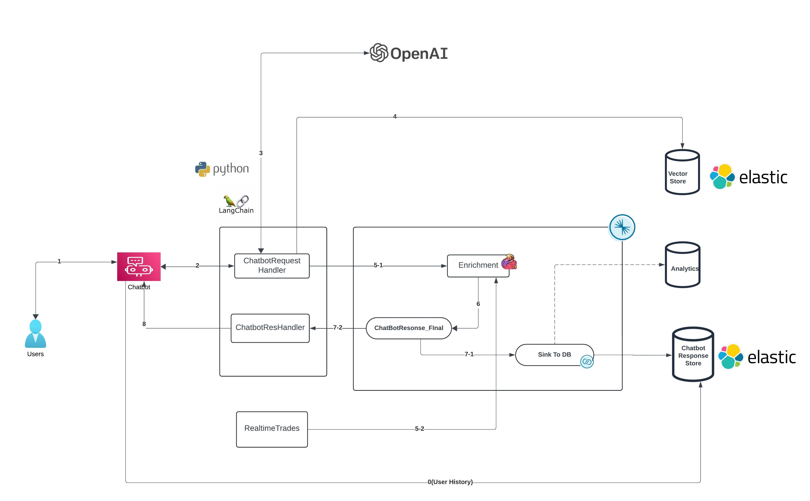

# Roboadvisor

A chatbot that will use PDF documents to simulate the extraction of information from an enterprise API that stores all investor portfolios. This increases the bot’s knowledge so that, together with real-time international market data obtained from APIs such as Polygon.io, it can combine these datasets and provide the user with a real-time financial advisor that not only knows their personal portfolio but also the current state of the global market.

This experience typically includes the following features:

1. **Data augmentation**:
   

   
   * Users upload financial documents or account summaries in PDF format, which can later be scaled to direct connections with the APIs of companies that store each client’s information..
   * The platform processes these documents by splitting them into individual pages and publishing the content of each page, along with the relevant metadata, to a Kafka topic..
   * A fully managed Elastic sink connector reads the vector data from the topic and stores the vector embeddings. The documents are now prepared for chatbot queries.
   * Create search index on vector embeddings field in Elastic


2. **AI-Powered Interaction**: The portal is integrated with a generative AI model (like GPT) that can read, understand, and interact with the content of the documents. Users can ask the chatbot questions related to the document, request summaries, seek clarifications, or ask for specific sections or details. The AI can generate responses based on the content of the documents.
   
   Data Inference flow:


   * Users submits query through chatbot prompt, python microservice receives request on HTTP and generate an event to Confluent topic.
   * Python-Kafka consumer receives chatbot request, query vector store (Elastic) using vector search and pass the information to OpenAI to get an answer.
   * In the given answer, if there are any reference transactions mentioned, Confluent Flink enrich the answer using real time data from other private data sources.
   * Once the answer is fully enriched, A Python-Kafka consumer receives the final response from topic and sends to chatbot using websocket.
   * The final response is sinked to a data store to enable for analytical and auditing use cases.
   * If the user question is already answered, workflow query the datastore and respond back to the chatbot.

3. **Contextual Understanding**: The chatbot can understand the context of questions in relation to the document's content, making the interaction more meaningful and accurate. It can pull information, generate summaries, and provide insights based on the document's data.

## Demo-Video

## Demo Setup:

### Prerequisites
#### Tools
* install git to clone the source
  https://git-scm.com/book/it/v2/Per-Iniziare-Installing-Git
  ```
  yum install git
  ```
* install npm to install UI dependency packages (below example to install npm from yum package)
  ```
  yum install npm
  ```
* install python3
  ```
  yum install python3
  yum install --assumeyes python3-pip
  ```


## Run python services
Navigate to services directory and excute the remaining steps in this section

```
cd services
```
Install python modules

```
pip3 install PyPDF2
pip3 install gcc
pip3 install confluent-kafka
pip3 install langchain
pip3 install fastavro
pip3 install elasticsearch
pip3 install langchain_elasticsearch
pip3 install flask
pip3 install openai
pip3 install pyopenssl
pip3 install --quiet langchain_experimental
pip3 install flask_socketio
pip3 install flask_cors
pip3 install avro-python3
pip3 install jproperties
pip3 install langchain_openai
pip3 install cachetools
pip3 install authlib
pip3 install pymongo
pip3 install websocket-client
pip3 install pandas
pip3 install pypdf

```
Set the env-vars

```
export OPENAI_API_KEY=<<OPEN_API_KEY>>
export ELASTIC_CLOUD=<<ELASTIC_CLOUD_ID>>
export ELASTIC_CLOUD_PASSWORD=<<ELASTIC_CLOUD_PASSWORD>>
```
Create client.properties file with Confluent connection parameters (this is needed for python services to run)
```
cat > client.properties
bootstrap.servers=<<confluent_cloud_bootstrap_url>>
security.protocol=SASL_SSL
sasl.mechanisms=PLAIN
sasl.username=<<CCLOUD_API_KEY>>
sasl.password=<<CCLOUD_API_SECRET>>
session.timeout.ms=45000
schema.registry.url=<<confluent_cloud_schema_registry>>
basic.auth.credentials.source=USER_INFO
basic.auth.user.info=<<SR_API_KEY>>:<<<<SR_API_SECRET>>
group.id=genai
auto.offset.reset=earliest
```
Run the python programs to receive data from UI and integrate with Confluent cloud
```
python3 server.py
python3 genaidocsexplorer.py -f client.properties -chatbotreq docs_chatbotreq_v1
python3 asyngenaichatres.py -f client.properties -chatbotresfinal docs_chatbotres_step_final_v1
python3 asyngenaichat.py -f client.properties -chatbotreq docs_chatbotreq_v1 -chatbotres docs_chatbotres_step_1 -chatbotresfinal docs_chatbotres_step_final_v1
```
## Run front-end code

Navigate to front-end

```
cd front-end
npm install
npm start
```
Go to browser try accessing UI: http://localhost:3000/


